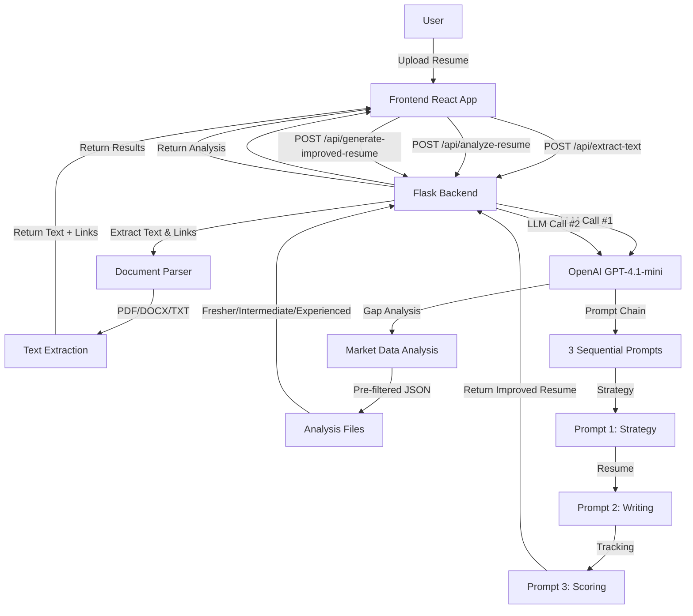
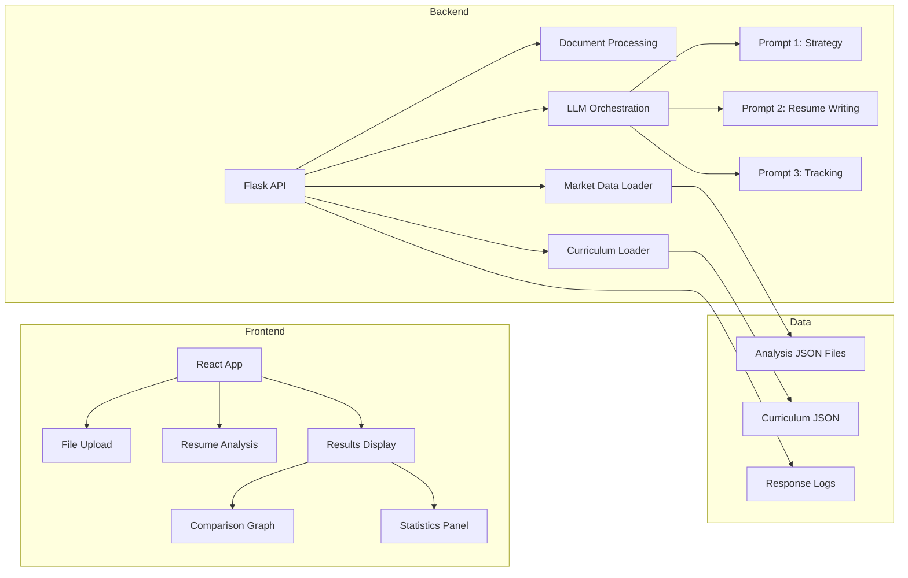
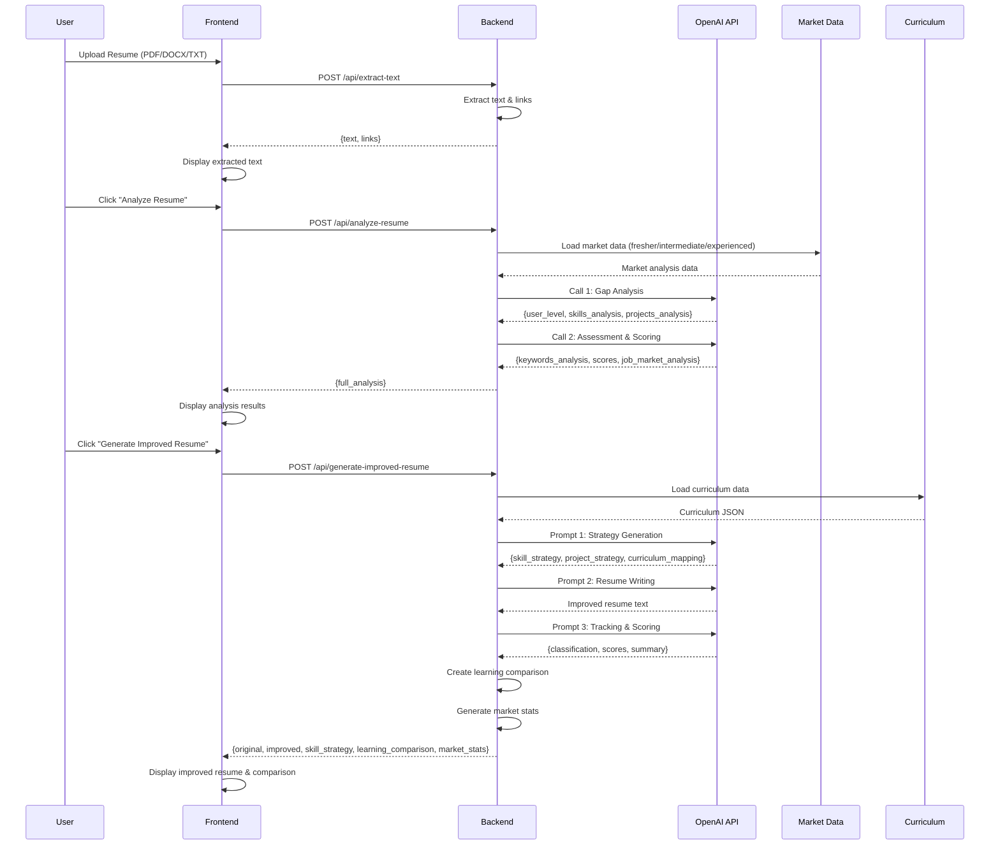
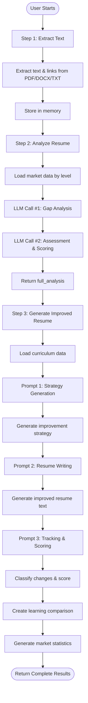
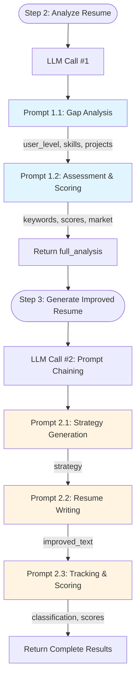
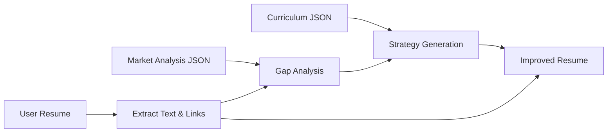

# AI Resume Analyzer

An intelligent resume analysis and improvement system specifically designed for Data Analytics professionals. This application analyzes resumes, identifies skill gaps, and generates improved versions aligned with market demands and the Coding Ninjas Data Analytics curriculum.

## 📋 Table of Contents

- [Overview](#overview)
- [Architecture](#architecture)
- [Application Flow](#application-flow)
- [Project Structure](#project-structure)
- [API Documentation](#api-documentation)
- [LLM Call Flow](#llm-call-flow)
- [Setup Instructions](#setup-instructions)
- [Configuration](#configuration)
- [Features](#features)

## 🎯 Overview

### High-Level Description

The AI Resume Analyzer is a full-stack web application that:

1. **Extracts** text and links from uploaded resume files (PDF, DOCX, TXT)
2. **Analyzes** resumes to determine experience level (Fresher/Intermediate/Experienced) and identify skill gaps
3. **Generates** improved resumes with:
   - Enhanced technical skills aligned with market demands
   - New projects from Coding Ninjas curriculum case studies
   - ATS-optimized formatting
   - Curriculum mapping showing which modules address identified gaps

### Key Technologies

- **Backend**: Flask (Python) with OpenAI GPT-4.1-mini
- **Frontend**: React.js with Chart.js for visualizations
- **Document Processing**: PyMuPDF (PDF), python-docx (DOCX)
- **AI Model**: OpenAI GPT-4.1-mini (via OpenAI API)

## 🏗️ Architecture

### System Architecture



### Component Architecture



## 🔄 Application Flow

### Complete User Journey



### Step-by-Step Process



## 📁 Project Structure

```
poc_ai-resume_analyzer/
├── backend/
│   ├── app.py                    # Main Flask application
│   ├── requirements.txt          # Python dependencies
│   ├── prompts/
│   │   ├── scoring_guidelines.txt    # Scoring rubrics
│   │   └── template.txt              # Base prompt template
│   └── templates/                 # Resume templates (unused in current version)
│
├── frontend/
│   ├── src/
│   │   ├── App.js                # Main React component
│   │   ├── components/
│   │   │   ├── DAResumeResult.js     # Results display component
│   │   │   ├── ComparisonGraph.js    # Learning comparison visualization
│   │   │   └── StatisticsPanel.js     # Market statistics display
│   │   └── config.js             # API configuration
│   └── package.json              # Node.js dependencies
│
├── Analysis/
│   ├── fresher.json              # Pre-analyzed market data (Fresher level)
│   ├── intermediate.json          # Pre-analyzed market data (Intermediate level)
│   └── experienced.json          # Pre-analyzed market data (Experienced level)
│
├── data-analytics-curriculum.json    # Coding Ninjas curriculum data
│
├── response/                     # API response logs (auto-generated)
│   ├── extract-text.json
│   ├── analyze-resume.json
│   └── generate-improved-resume.json
│
└── README.md                     # This file
```

## 🔌 API Documentation

### Base URL

```
http://localhost:5000
```

### Endpoints

#### 1. `GET /`

**Description**: Root endpoint providing API information

**Response**:
```json
{
  "status": "ok",
  "message": "AI Resume Analyzer API",
  "version": "2.0",
  "endpoints": {
    "health": "/api/health",
    "extract_text": "/api/extract-text",
    "analyze_resume": "/api/analyze-resume",
    "generate_improved_resume": "/api/generate-improved-resume"
  }
}
```

---

#### 2. `GET /api/health`

**Description**: Health check endpoint

**Response**:
```json
{
  "status": "ok",
  "message": "Backend is running",
  "market_insights_mode": "dynamic_from_llm"
}
```

---

#### 3. `POST /api/extract-text`

**Description**: Extracts text and links from uploaded resume file

**Request**:
- **Method**: `POST`
- **Content-Type**: `multipart/form-data`
- **Body**: 
  - `file`: Resume file (PDF, DOCX, or TXT)

**Response**:
```json
{
  "text": "Extracted resume text...",
  "links": [
    {
      "url": "https://www.linkedin.com/in/...",
      "text": "LinkedIn Profile",
      "page": 1,
      "source": "annotation"
    }
  ]
}
```

**Process**:
1. Receives file upload
2. Determines file type (PDF/DOCX/TXT)
3. Extracts text content
4. For PDFs: Extracts embedded links and plain-text URLs
5. Stores text and links in memory for Step 3
6. Returns extracted data

**Supported Formats**:
- PDF (`.pdf`) - Extracts text and links
- DOCX (`.docx`) - Extracts text only
- TXT (`.txt`) - Reads plain text

---

#### 4. `POST /api/analyze-resume`

**Description**: Analyzes resume and determines Data Analytics experience level (LLM Call #1)

**Request**:
- **Method**: `POST`
- **Content-Type**: `application/json`
- **Body**:
```json
{
  "text": "Resume text from Step 1"
}
```

**Response**:
```json
{
  "full_analysis": {
    "user_level": "Fresher",
    "experience_reasoning": "...",
    "skills_analysis": {
      "has_skills": ["Python", "SQL", "Excel"],
      "missing_skills": ["Power BI", "Statistics"]
    },
    "projects_analysis": {
      "projects_to_keep": ["E-Commerce Analysis"],
      "projects_to_remove": ["Web Development Project"]
    },
    "keywords_analysis": {
      "present_keywords": ["Pandas", "NumPy", "CTEs"],
      "missing_keywords": ["DAX", "Power Query"]
    },
    "scores": {
      "job_relevance_score": 85,
      "ats_score": 88,
      "score_reasoning": "..."
    },
    "job_market_analysis": {
      "jobs_analyzed": 150,
      "top_skills": ["Excel (appears in 91.01%) - Demand: Critical", ...]
    },
    "analysis_summary": "..."
  }
}
```

**Process**:
1. Receives resume text
2. Loads pre-analyzed market data (fresher/intermediate/experienced)
3. Makes **2 LLM calls**:
   - **Call 1**: Gap Analysis (determines level, skills, projects)
   - **Call 2**: Assessment & Scoring (keywords, ATS, scores)
4. Merges results and returns complete analysis

---

#### 5. `POST /api/generate-improved-resume`

**Description**: Generates improved resume using prompt chaining (LLM Call #2 with 3 sequential prompts)

**Request**:
- **Method**: `POST`
- **Content-Type**: `application/json`
- **Body**:
```json
{
  "full_analysis": {
    // Complete analysis from Step 2
  },
  "stop_after_prompt2": false,  // Optional: for testing
  "run_id": "run_1"             // Optional: for logging
}
```

**Response**:
```json
{
  "original": {
    "resume_text": "...",
    "job_relevance_score": 85,
    "ats_score": 88,
    "has_skills": [...],
    "missing_skills": [...],
    "user_level": "Fresher"
  },
  "improved": {
    "resume_text": "Improved resume text...",
    "job_relevance_score": 92,
    "ats_score": 95,
    "skills_added": ["Statistics"],
    "skills_enhanced": ["SQL → Advanced SQL (CTEs, Window Functions)"],
    "projects_added": ["Loan Default"],
    "modification_summary": "..."
  },
  "skill_strategy": {
    "skills_to_enhance": [...],
    "skills_to_add": [...]
  },
  "project_strategy": {
    "projects_removed": [...],
    "projects_kept": [...],
    "projects_added": [...]
  },
  "learning_comparison": {
    "conventional_learning": {...},
    "cn_course_learning": {...}
  },
  "market_stats": {
    "jobs_analyzed": 150,
    "top_skills": [...],
    "resume_has": 3,
    "curriculum_covers": 5
  },
  "curriculum_used": [...]
}
```

**Process**:
1. Receives full analysis from Step 2
2. Loads curriculum data from JSON
3. Executes **3 sequential LLM prompts**:
   - **Prompt 1**: Strategy Generation
   - **Prompt 2**: Resume Writing
   - **Prompt 3**: Tracking & Scoring
4. Creates learning comparison (no AI)
5. Generates market statistics
6. Returns complete results

---

## 🤖 LLM Call Flow

### Overview

The application makes **2 main LLM calls** with **5 total prompts**:

1. **LLM Call #1** (Step 2): Resume Analysis
   - Prompt 1.1: Gap Analysis
   - Prompt 1.2: Assessment & Scoring

2. **LLM Call #2** (Step 3): Resume Generation
   - Prompt 2.1: Strategy Generation
   - Prompt 2.2: Resume Writing
   - Prompt 2.3: Tracking & Scoring

### LLM Call #1: Resume Analysis

#### Prompt 1.1: Gap Analysis

**Purpose**: Determine experience level and identify skill/project gaps

**Model**: `gpt-4.1-mini`  
**Temperature**: `0.0` (fully deterministic)  
**Max Tokens**: `800`  
**Response Format**: `json_object`

**Input**:
- Resume text
- Market top 10 skills by level (fresher/intermediate/experienced)
- Curriculum skills filter

**Output**:
```json
{
  "user_level": "Fresher",
  "experience_reasoning": "...",
  "skills_analysis": {
    "has_skills": [...],
    "missing_skills": [...]
  },
  "projects_analysis": {
    "projects_to_keep": [...],
    "projects_to_remove": [...]
  }
}
```

**Logic**:
1. Calculate DA work duration from dates
2. Classify level: ≤1yr (Fresher), 1-3yr (Intermediate), >3yr (Experienced)
3. Extract and normalize skills from resume
4. Compare against market top 10 for detected level
5. Filter missing skills to curriculum-only
6. Evaluate projects for DA relevance

---

#### Prompt 1.2: Assessment & Scoring

**Purpose**: Extract keywords, assess ATS compatibility, and calculate scores

**Model**: `gpt-4.1-mini`  
**Temperature**: `0.1`  
**Max Tokens**: `900`  
**Response Format**: `json_object`

**Input**:
- Resume text
- Gap analysis from Prompt 1.1
- Market data for detected level
- Scoring guidelines

**Output**:
```json
{
  "keywords_analysis": {
    "present_keywords": [...],
    "missing_keywords": [...]
  },
  "ats_analysis": {
    "reasoning": "..."
  },
  "scores": {
    "job_relevance_score": 85,
    "ats_score": 88,
    "score_reasoning": "..."
  },
  "job_market_analysis": {
    "jobs_analyzed": 150,
    "top_skills": [...]
  },
  "analysis_summary": "..."
}
```

**Logic**:
1. Extract ALL specific technical keywords (not just tool names)
2. Compare against market top skills
3. Assess ATS compatibility (structure/format)
4. Calculate job relevance and ATS scores using guidelines
5. Generate market analysis with top skills

---

### LLM Call #2: Resume Generation (Prompt Chaining)

#### Prompt 2.1: Strategy Generation

**Purpose**: Generate improvement strategy (skills to enhance/add, projects to add/remove)

**Model**: `gpt-4.1-mini`  
**Temperature**: `0.0` (fully deterministic)  
**Max Tokens**: `1024`  
**Response Format**: `json_object`

**Input**:
- Gap analysis (has_skills, missing_skills, present_keywords)
- Project analysis (projects_to_keep, projects_to_remove)
- User level
- Complete curriculum data

**Output**:
```json
{
  "skill_strategy": {
    "skills_to_enhance": [
      {
        "base": "SQL",
        "enhanced": "Advanced SQL (CTEs, Window Functions)",
        "module": "Analytics with SQL"
      }
    ],
    "skills_to_add": [
      {
        "skill": "Power BI",
        "module": "Data Visualization with Power BI"
      }
    ]
  },
  "project_strategy": {
    "projects_removed": [...],
    "projects_kept": [...],
    "projects_added": [
      {
        "name": "Loan Default",
        "module": "Statistics & EDA with Python",
        "technologies": [...],
        "description": "..."
      }
    ],
    "final_project_count": 5
  },
  "curriculum_mapping": {
    "modules_used": [
      {
        "module": "Analytics with SQL",
        "addresses_gaps": ["SQL"],
        "projects_included": [...],
        "skills_added_from_module": [...],
        "skills_enhanced_by_module": [...]
      }
    ]
  }
}
```

**Logic**:
1. **Skills to Enhance**: Check if advanced topics from curriculum are missing from present_keywords
2. **Skills to Add**: Map missing_skills to curriculum modules
3. **Projects**: Remove irrelevant, add curriculum case studies (count = removed projects)
4. **Curriculum Mapping**: Track all modules used and what gaps they address

---

#### Prompt 2.2: Resume Writing

**Purpose**: Generate improved ATS-friendly resume text

**Model**: `gpt-4.1-mini`  
**Temperature**: `0.1`  
**Max Tokens**: `2500`  
**Response Format**: `text` (plain text, not JSON)

**Input**:
- Original resume text
- Embedded links from Step 1
- Improvement strategy from Prompt 2.1
- User level
- Current year

**Output**: Complete improved resume text (plain text format)

**Structure**:
1. **Header**: Name, contact info, links (preserved from original)
2. **Professional Summary**: 2 sentences max
3. **Technical Skills**: Categorized (Programming, Data Visualization, Soft Skills, Other Tools)
4. **Professional Experience**: Conditional (only if non-Fresher with DA-related experience)
5. **Education**: Graduation/post-graduation only
6. **Projects**: Original projects (kept) + new curriculum projects (added)
7. **Certifications**: Original + Coding Ninjas (if missing)

**Key Rules**:
- Preserve all original links exactly
- Use ATS-friendly formatting
- No invented metrics/outcomes
- Maintain original project details
- Add curriculum case studies as projects

---

#### Prompt 2.3: Tracking & Scoring

**Purpose**: Extract classifications from strategy and score improved resume

**Model**: `gpt-4.1-mini`  
**Temperature**: `0.0`  
**Max Tokens**: `1000`  
**Response Format**: `json_object`

**Input**:
- Strategy from Prompt 2.1 (source of truth)
- Improved resume text from Prompt 2.2
- Gap analysis from Step 2
- Scoring guidelines

**Output**:
```json
{
  "classification": {
    "skills_enhanced": [
      {
        "original": "SQL",
        "improved": "Advanced SQL (CTEs, Window Functions)"
      }
    ],
    "skills_added": ["Statistics"],
    "projects_added": ["Loan Default"]
  },
  "curriculum_mapping": {
    "modules_used": [...]
  },
  "scores": {
    "job_relevance_score": 92,
    "ats_score": 95,
    "estimated_improvement": 60
  },
  "summary": "..."
}
```

**Logic**:
1. Extract classifications from strategy (NOT from resume)
2. Transform to output format
3. Score improved resume using guidelines
4. Calculate estimated improvement percentage
5. Copy curriculum mapping from strategy

---

### LLM Call Flow Diagram



## 🚀 Setup Instructions

### Prerequisites

- Python 3.8+
- Node.js 16+
- OpenAI API Key

### Backend Setup

1. **Navigate to backend directory**:
```bash
cd backend
```

2. **Create virtual environment**:
```bash
python -m venv venv
source venv/bin/activate  # On Windows: venv\Scripts\activate
```

3. **Install dependencies**:
```bash
pip install -r requirements.txt
```

4. **Create `.env` file**:
```bash
OPENAI_API_KEY=your_openai_api_key_here
PORT=5000
```

5. **Ensure required data files exist**:
   - `../Analysis/fresher.json`
   - `../Analysis/intermediate.json`
   - `../Analysis/experienced.json`
   - `../data-analytics-curriculum.json`

6. **Run the server**:
```bash
python app.py
```

Server will start on `http://localhost:5000`

### Frontend Setup

1. **Navigate to frontend directory**:
```bash
cd frontend
```

2. **Install dependencies**:
```bash
npm install
```

3. **Configure API URL** (if needed):
   - Edit `src/config.js` to set API base URL

4. **Start development server**:
```bash
npm start
```

Frontend will start on `http://localhost:3000`

## ⚙️ Configuration

### Environment Variables

**Backend** (`.env` file):
- `OPENAI_API_KEY`: Your OpenAI API key (required)
- `PORT`: Server port (default: 5000)

**Frontend** (`src/config.js`):
- `apiUrl`: Backend API URL (default: `http://localhost:5000`)

### Data Files

**Market Analysis Files** (`Analysis/`):
- `fresher.json`: Pre-analyzed job market data for fresher level
- `intermediate.json`: Pre-analyzed job market data for intermediate level
- `experienced.json`: Pre-analyzed job market data for experienced level

**Curriculum File**:
- `data-analytics-curriculum.json`: Coding Ninjas Data Analytics course curriculum

### Model Configuration

**Current Settings**:
- Model: `gpt-4.1-mini`
- Temperature: `0.0` (Gap Analysis, Strategy, Tracking) / `0.1` (Assessment, Resume Writing)
- Max Tokens: `800-2500` (varies by prompt)

## ✨ Features

### Core Features

1. **Multi-Format Support**: PDF, DOCX, TXT file uploads
2. **Link Extraction**: Extracts embedded and plain-text URLs from PDFs
3. **Experience Level Detection**: Automatically classifies as Fresher/Intermediate/Experienced
4. **Skill Gap Analysis**: Identifies missing skills compared to market demands
5. **Project Evaluation**: Determines which projects are DA-relevant
6. **Resume Improvement**: Generates ATS-optimized improved resume
7. **Curriculum Mapping**: Maps identified gaps to Coding Ninjas curriculum modules
8. **Learning Comparison**: Shows conventional vs. CN course learning timeline

### Advanced Features

1. **Prompt Chaining**: 3 sequential prompts for strategy → writing → tracking
2. **Market Data Integration**: Uses pre-analyzed job market data by experience level
3. **ATS Optimization**: Generates ATS-friendly resume format
4. **Link Preservation**: Maintains all original links in improved resume
5. **Response Logging**: Auto-saves API responses to JSON files
6. **Stability Testing**: Built-in support for testing prompt stability

## 📊 Data Flow

### Data Sources



### Memory Management

- **Step 1**: Extracted text and links stored in `EXTRACT_TEXT_DATA` (in-memory)
- **Step 2**: Analysis results returned to frontend (not stored)
- **Step 3**: Uses stored data from Step 1 + analysis from Step 2

## 🔍 Key Algorithms

### Experience Level Detection

```
IF work_duration ≤ 1.00 years:
    level = "Fresher"
ELSE IF work_duration ≤ 3.00 years:
    level = "Intermediate"
ELSE:
    level = "Experienced"
```

### Skill Enhancement Logic

```
FOR each skill in has_skills:
    advanced_topics = get_advanced_topics_from_curriculum(skill)
    IF advanced_topics NOT IN present_keywords:
        IF user_level allows (not basic for Intermediate+):
            ADD to skills_to_enhance
```

### Project Replacement Logic

```
removed_count = len(projects_to_remove)
projects_to_add = select_case_studies_from_curriculum(
    count=removed_count,
    match_user_level=True,
    support_new_skills=True
)
```

## 🧪 Testing

### Stability Testing

A test script is provided to test prompt stability:

```bash
python test_prompt2_stability.py
```

This runs the complete flow 10 times and captures Prompt 2 responses for variance analysis.

## 📝 Notes

- All LLM calls use structured JSON responses where applicable
- Temperature settings optimized for consistency vs. creativity trade-off
- Market data is pre-analyzed and loaded at startup (not analyzed per request)
- Curriculum data is loaded from JSON file (not from external API)
- Response logging saves all API responses to `response/` directory

## 🤝 Contributing

This is a proof-of-concept project. For improvements:

1. Reduce temperature further for more consistency
2. Add post-processing validation for required content
3. Implement caching for repeated analyses
4. Add more file format support
5. Enhance error handling and retry logic

## 📄 License

[Add your license information here]

---

**Version**: 2.0  
**Last Updated**: 2025

